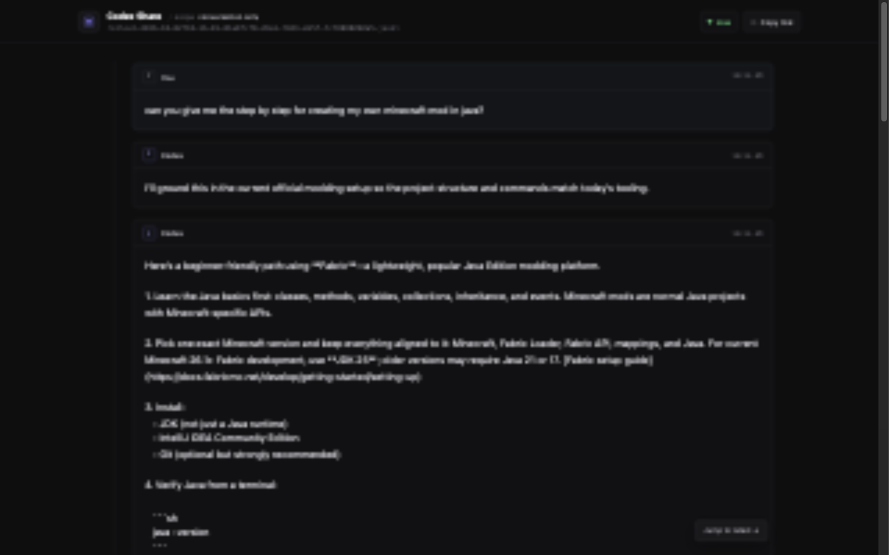

# codex-share

Share a masked, read-only live view of a local Codex thread. The host continues using Codex normally while `codex-share` tails its rollout JSONL and serves an authenticated viewer.



## Quick start

Install the [Rust toolchain](https://www.rust-lang.org/tools/install), then run:

```console
cargo run --release
```

`codex-share` opens an interactive picker of recent threads, showing each thread ID, relative time, and first user-message preview. Select a number to create a share link, or enter `q` to cancel.

Use an explicit rollout file when scripting or sharing a known thread:

```console
cargo run --release -- --file ~/.codex/sessions/2026/10/02/rollout-....jsonl
```

Skip the picker and share the newest session:

```console
cargo run --release -- --latest
```

Show more than the default 12 recent threads:

```console
cargo run --release -- --recent 20
```

## Sharing options

Conversation-only is the default. Grant only the extra information a viewer needs:

```console
cargo run --release -- --permission activity
cargo run --release -- --permission diffs
cargo run --release -- --permission activity-diffs
```

The viewer opens on the newest events, follows them while the viewer remains at the bottom, progressively loads older retained events near the top, and shows an in-thread working state during active turns. The retained window defaults to 2,000 normalized events and can be changed with `--history`.

Use a tunnel to create a public link:

```console
cargo run --release -- --tunnel cloudflare
cargo run --release -- --tunnel ngrok
```

Cloudflare Quick Tunnels need only `cloudflared` on your `PATH`. ngrok additionally needs an `NGROK_AUTHTOKEN` environment variable or an `authtoken:` entry in its normal configuration file. Check both providers before sharing:

```console
cargo run --release -- --check-tunnels
```

Add literal values that should always be masked:

```console
cargo run --release -- --redact customer-name --redact internal.example.com
CODEX_SHARE_REDACT=customer-name,internal.example.com cargo run --release
```

## Security model

Raw rollout records are never sent to the browser. The local process can project only:

- user and assistant message text;
- tool name plus started/completed state, when activity is granted;
- structured file paths and patch content, when diffs are granted;
- coarse working/idle state for the in-thread live indicator.

The default conversation grant exposes messages plus that coarse turn state. It does not expose which tools are running. Internal instructions, reasoning records, environment/configuration, command arguments, command output, and unknown future record types are always dropped. Allowed message and diff text is then masked for home-directory paths, common token formats, secret assignments, URL credentials, and user-supplied literal values.

Permissions are enforced by the server for both the snapshot and live WebSocket stream. Each capability token is minted with its scope (`cs1_c_…`, `cs1_ca_…`, `cs1_cd_…`, or `cs1_cad_…`); changing that visible scope marker invalidates the token. No scope exposes command output, raw tool arguments, or reasoning. Diff scopes expose masked file paths and patch content, capped at 100 files and 256 KiB per event.

Share tokens have 192 bits of entropy, live in the URL path, are checked by the local server, and expire when the process exits. The server binds to `127.0.0.1:48123` by default.

This is defense in depth, not a guarantee that arbitrary prose contains no sensitive information. Review what the agent is discussing before sharing it.

## Architecture direction

`JsonlSource -> PublicEvent -> Masker -> SharedFeed -> HTTP/WebSocket`

The next ingestion adapter should speak the versioned App Server protocol and emit the same `PublicEvent` values. App Server schemas should be generated from the installed Codex binary so the adapter stays aligned with that exact CLI version.

The tunnel is isolated behind `ExposureProvider`; ngrok and Cloudflare Quick Tunnels are initial subprocess implementations.
